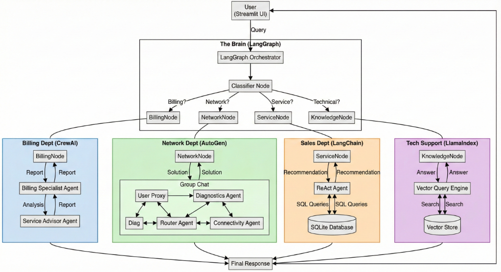

# Telecom Service Assistant

A next-generation, multi-agent AI assistant designed to revolutionize telecom customer service. This application integrates multiple advanced AI frameworks—**LangGraph**, **CrewAI**, **AutoGen**, **LangChain**, and **LlamaIndex**—into a unified, intelligent interface powered by **Streamlit**.



## 🚀 Project Overview

The Telecom Service Assistant is designed to handle a wide range of customer and admin tasks by routing queries to specialized agents. It hides the complexity of the underlying multi-agent architecture behind a simple, user-friendly chat interface.

### Key Capabilities
- **Billing Inquiries**: Analyzes usage data and bills to explain charges and recommend cost-saving plans (powered by **CrewAI**).
- **Network Diagnostics**: collaboratively troubleshoots network issues, checks for outages, and guides users through fixes (powered by **AutoGen**).
- **Service Plans**: Recommends the best mobile plans based on user needs and database records (powered by **LangChain**).
- **Technical Support**: Answers technical questions using a Retrieval-Augmented Generation (RAG) system on uploaded documentation (powered by **LlamaIndex**).
- **Intelligent Routing**: Uses a classifier to automatically direct user queries to the correct specialist agent (orchestrated by **LangGraph**).

## 🏗️ Architecture

The project uses a hub-and-spoke architecture where **LangGraph** acts as the central brain, managing state and routing.

- **Orchestrator**: `LangGraph`
- **UI**: `Streamlit`
- **Database**: `SQLite`
- **Vector Store**: `ChromaDB`
- **LLM**: `OpenAI GPT-4o`

### Agent Frameworks
| Domain | Framework | Role |
|--------|-----------|------|
| **Billing** | CrewAI | Sequential task execution for data analysis and advisory. |
| **Network** | AutoGen | Multi-agent group chat for complex troubleshooting. |
| **Plans** | LangChain | ReAct agent for database querying and reasoning. |
| **Support** | LlamaIndex | RAG engine for searching technical docs. |

## 📂 Project Structure

```
telecom_assistant/
├── agents/                 # Agent definitions
│   ├── billing_agents.py   # CrewAI agents
│   ├── network_agents.py   # AutoGen agents
│   ├── service_agents.py   # LangChain agents
│   └── knowledge_agents.py # LlamaIndex agents
├── config/                 # Configuration settings
├── data/                   # SQLite database and raw data
├── orchestration/          # LangGraph state and routing logic
├── ui/                     # Streamlit application
├── utils/                  # Helper functions
├── app.py                  # Main entry point
└── requirements.txt        # Python dependencies
```

## 🛠️ Installation

1.  **Clone the repository**:
    ```bash
    git clone https://github.com/yourusername/telecom-assistant.git
    cd telecom-assistant
    ```

2.  **Create a virtual environment** (optional but recommended):
    ```bash
    python -m venv venv
    # Windows
    venv\Scripts\activate
    # Mac/Linux
    source venv/bin/activate
    ```

3.  **Install dependencies**:
    ```bash
    pip install -r requirements.txt
    ```

4.  **Set up environment variables**:
    Create a `.env` file in the root directory and add your OpenAI API key:
    ```env
    OPENAI_API_KEY=sk-your-api-key-here
    ```

## ▶️ Usage

1.  **Run the application**:
    ```bash
    streamlit run app.py
    ```

2.  **Login**:
    - **Admin**: `admin@example.com` (Access to dashboard, doc uploads)
    - **Customer**: Use any email from the `customers` table in `data/telecom.db` (e.g., `john.doe@example.com`).

3.  **Interact**:
    - Ask questions like:
        - "Why is my bill so high this month?"
        - "I have no signal in Mumbai."
        - "What is the best plan for a family of 4?"
        - "How do I enable VoLTE?"

## 📄 License

This project is licensed under the MIT License.
